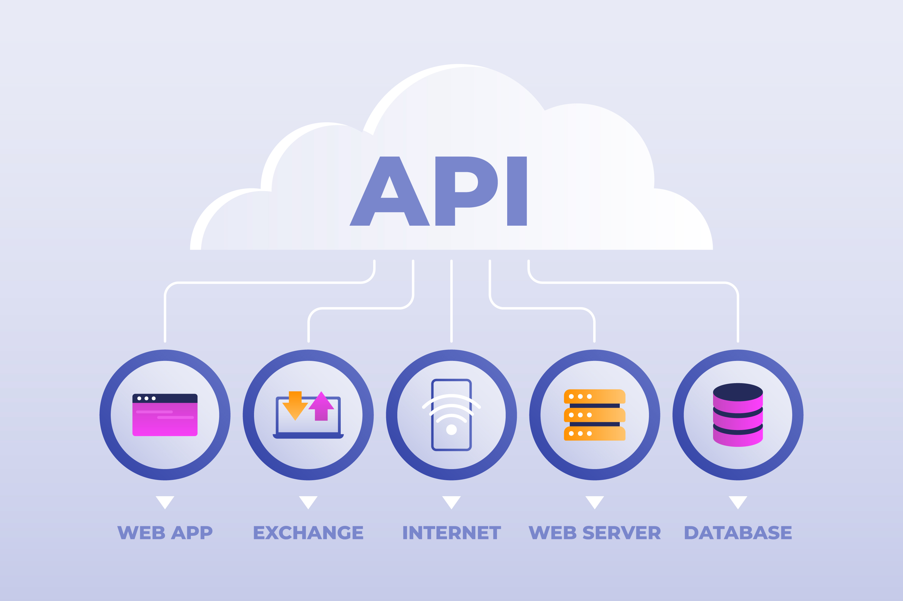

<div align="center">
    <h1>Calories Manager RESTful Web Service</h1>

</div>
<div align="center">
    Final Project in Asynchronous Server Side Course
</div>

## 🧐 Introduction <a name = "introduction"></a>

A Backend RESTful API for tracking daily calorie intake. Created as a final project for the course "Asynchronous Server Side" at [Holon Institute of Technology (HIT)](https://www.hit.ac.il/). The API allows a pre-defined user to track their daily calorie intake, by providing the ability to add calorie consumption and retrieve a report, organized by meal time (breakfast, lunch, dinner, and other), of the total calorie intake for a specific month and year.

## ⛏️ Built Using <a name = "built-using"></a>

<table>
    <thead>
        <tr>
            <th>Property</th>
            <th>Badges</th>
        </tr>
    </thead>
    <tbody>
        <tr>
            <td>📋 Languages & Tools</td>
            <td>
                <a href="https://www.javascript.com/"></a>
                <a href="https://pugjs.org/api/getting-started.html"></a>
                <a href="https://www.w3.org/Style/CSS/Overview.en.html"></a>
            </td>
        </tr>
        <tr>
            <td>🚀 Runtime Environment</td>
            <td>
                <a href="https://nodejs.org/"></a>
                <a href="https://www.npmjs.com/"></a>
            </td>
        </tr>
        <tr>
            <td>🔧 Utility Libraries</td>
            <td>
                <a href="https://nodemon.io/"></a>
                <a href="https://www.dotenv.org/"></a>
                <a href="https://www.uuidgenerator.net/version4"></a>
            </td>
        </tr>
        <tr>
            <td>📡 Backend</td>
            <td>
                <a href="https://expressjs.com/"></a>
                <a href="https://express-validator.github.io/docs"></a>
            </td>
        </tr>
        <tr>
            <td>🗄️ Database</td>
            <td>
                <a href="https://www.mongodb.com/"></a>
                <a href="https://www.mongoosejs.com/"></a>
        </tr>
        <tr>
        <td>🧪 Testing</td>
            <td>
                <a href="https://mochajs.org/"></a>
                <a href="https://www.chaijs.com/"></a>
                <a href="https://www.thunderclient.com/"></a>
            </td>
        </tr>
        <tr>
        <td>☁️ Hosting</td>
            <td>
                <a href="https://render.com/"></a>
            </td>
        </tr>
    </tbody>
</table>

## 🏁 Getting Started <a name = "getting-started"></a>

1. Clone the repository

```bash
git clone https://github.com/MaorBezalel/calories-manager.git
```

2. Install the required packages

```bash
npm install
```

3. Create a `.env` file in the root directory and add the following environment variables:

```env
MONGODB_URI=<Your MongoDB URI>
MONGODB_DB_NAME=<Your MongoDB Database Name>
MONGO_TEST_DB_NAME=<Your MongoDB Test Database Name>
```

4. Run the server

```bash
npm run start:dev
```

## 💡 Useful Resources <a name ="useful-resources"></a>

-   [Thunder Client](https://www.thunderclient.com/) - A REST API client extension for Visual Studio Code. Similar to [Postman](https://www.postman.com/) and very easy to use.
-   [nodemon](https://nodemon.io/) - A utility that will monitor for any changes in your source and automatically restart your server. Perfect for development.
-   [apiDoc](https://apidocjs.com/) - A tool for creating documentation from API annotations in the source code.
-   [FREEPIK](https://www.freepik.com/) - A website for free vector images, illustrations, icons, and photos.
-   [Render](https://render.com/) - A cloud platform that makes it easy for developers to build, deploy, and scale web services for free.

## 🙏 Acknowledgements <a name ="acknowledgements"></a>

-   [FREEPIK](https://www.freepik.com/) - For the free vector image used as the preview image in this README file.
